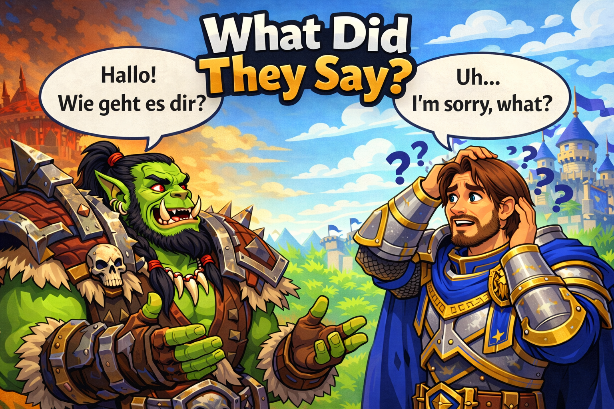

# What Did They Say? (Beta)

> **In-game chat translation for World of Warcraft Classic**

## ☕ Support the Developer

If this addon has helped you, please consider [buying me a coffee](https://buymeacoffee.com/rossnicholson)! 🙏

**⚠️ BETA VERSION ⚠️**

Now supports **German (de → en)**, **French (fr → en)**, and **WoW Abbreviations (wow → en)**! Additional languages to follow.

An addon that translates chat messages in-game using local Lua logic—no external APIs or internet connection required.

---

## 🚀 Quick Start

1. **Download** from [Releases](https://github.com/RossNicholson/WhatDidTheySay/releases)
2. **Extract** to `World of Warcraft\_classic_era_\Interface\AddOns\WhatDidTheySay\`
3. **Enable** in WoW Classic AddOns menu
4. **Configure** with `/wdts` command

**📖 Need help?** See the [Installation Guide](https://github.com/RossNicholson/WhatDidTheySay/wiki/Installation)

---

## ✨ Key Features

- ✅ **100% Offline** - All translation happens locally in-game
- ✅ **German Support** - German → English translation (comprehensive vocabulary & grammar)
- ✅ **French Support** - French → English translation (v0.6.0)
- ✅ **WoW Abbreviations Pack** - Expand gaming abbreviations independently (v0.7.0) 🆕
- ✅ **Dependency Parsing** - Structure-based translation for accurate word order (v0.5.0)
- ✅ **Auto-Translation** - Automatically translates when confidence is sufficient
- ✅ **Intent Detection** - Understands LFG, invites, ready status, etc.
- ✅ **Safe & Conservative** - Stays silent when uncertain
- ✅ **Configurable** - Choose which channels to translate

---

## 💻 Basic Usage

**Commands:**
- `/wdts` - Open configuration window
- `/wdts test <message>` - Test translation
- `/wdts debug` - Show translation history

Translations appear automatically in chat when confidence ≥ 0.50 (green for high confidence, yellow for medium).

**📖 See [User Guide](https://github.com/RossNicholson/WhatDidTheySay/wiki/User-Guide) for complete usage instructions**

---

## 📋 System Requirements

- **World of Warcraft Classic** (Era version)
- **Interface Version**: 11508
- **Dependencies**: None (Titan Panel optional)

---

## 🌐 Supported Languages

**Currently Available:**
- ✅ **German (de → en)** - **Beta**
- ✅ **French (fr → en)** - **Beta**
- ✅ **WoW Abbreviations (wow → en)** - **Beta** 🆕

**More languages to follow:**
- ⏳ Russian, Spanish, Portuguese, Italian, Polish, Dutch, Swedish, and more

**📖 See [Language Packs](https://github.com/RossNicholson/WhatDidTheySay/wiki/Language-Packs) for details**

---

## 📚 Documentation

**Complete documentation is available in the [Wiki](https://github.com/RossNicholson/WhatDidTheySay/wiki):**

- **[Wiki Home](https://github.com/RossNicholson/WhatDidTheySay/wiki)** - Complete documentation hub
- **[Releases](https://github.com/RossNicholson/WhatDidTheySay/wiki/Releases)** - Downloads and version information
- **[Installation Guide](https://github.com/RossNicholson/WhatDidTheySay/wiki/Installation)** - Detailed setup instructions
- **[User Guide](https://github.com/RossNicholson/WhatDidTheySay/wiki/User-Guide)** - How to use the addon
- **[Configuration](https://github.com/RossNicholson/WhatDidTheySay/wiki/Configuration)** - Configuration options
- **[Troubleshooting](https://github.com/RossNicholson/WhatDidTheySay/wiki/Troubleshooting)** - Common issues and solutions
- **[FAQ](https://github.com/RossNicholson/WhatDidTheySay/wiki/FAQ)** - Frequently asked questions
- **[Technical Details](https://github.com/RossNicholson/WhatDidTheySay/wiki/Technical-Details)** - How it works
- **[Contributing](https://github.com/RossNicholson/WhatDidTheySay/wiki/Contributing)** - How to contribute

---

## 🐛 Problems?

- **Not working?** See [Troubleshooting Guide](https://github.com/RossNicholson/WhatDidTheySay/wiki/Troubleshooting)
- **Questions?** Check the [FAQ](https://github.com/RossNicholson/WhatDidTheySay/wiki/FAQ)
- **Found a bug?** [Report it](https://github.com/RossNicholson/WhatDidTheySay/issues)
- **Want to help?** See [Contributing Guide](https://github.com/RossNicholson/WhatDidTheySay/wiki/Contributing)

---

## 📦 Current Version

**v0.6.0** - French language pack expansion! Now supports both German and French translations with comprehensive vocabulary, phrases, and patterns.

**📖 See [Releases](https://github.com/RossNicholson/WhatDidTheySay/wiki/Releases) for downloads and [Version History](https://github.com/RossNicholson/WhatDidTheySay/wiki/Version-History) for changelog**

---

## 🤝 Contributing

Contributions welcome! See the [Contributing Guide](https://github.com/RossNicholson/WhatDidTheySay/wiki/Contributing) for details.

---

## 📝 License

MIT License - see [LICENSE](LICENSE) file for details.

---

**Made with ❤️ for the WoW Classic community**

*Developed by Ross Nicholson*
